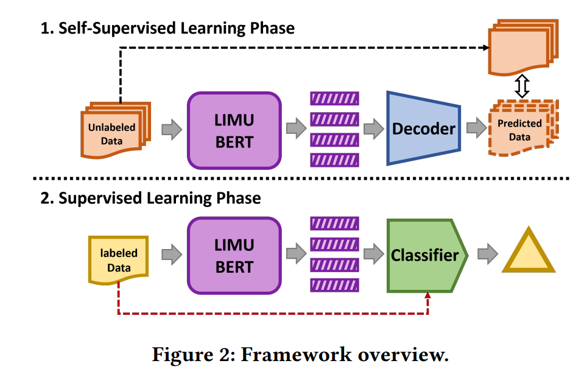
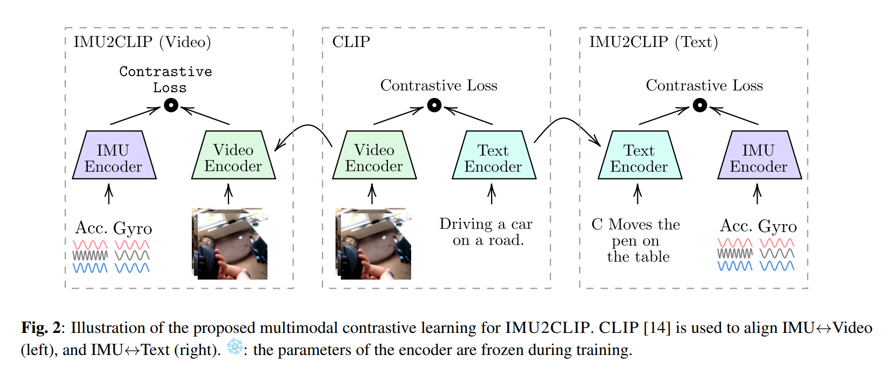
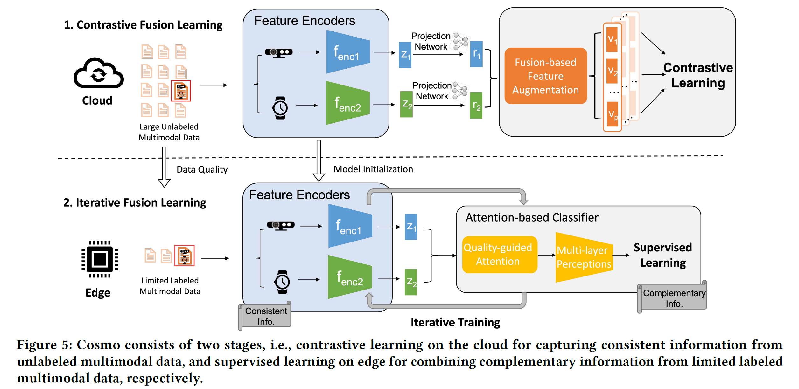
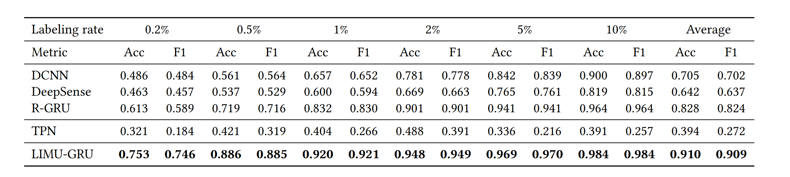

# IMU-demo

## reference
1. \[2020\] LIMU-BERT: Unleashing the Potential of Unlabeled Data for IMU Sensing Applications
2. \[2023\] IMU2CLIP: MULTIMODAL CONTRASTIVE LEARNING FOR IMU MOTION SENSORS FROM EGOCENTRIC VIDEOS AND TEXT NARRATIONS

## thoughts
1. traditional method for the task: unsupervised learning, like KNN is used to classify the unlabeled  data, and we use supervised learning to align the labels with the classes of data.  
2. With the rise of Transformer, like LIMU-BERT, we can use the unlabeled data to train a feature encoder to represent the data distribution by self-supervised learning(unsupervised learning), and we can fine-tune the model to align with the labels by supervised learning.  

3. With the development of GPT, it is reasonable to think a method like CLIP to represent two modals, IMU and text, using contrastive learning, and I find the IMU2CLIP. And I also find some researches using ChatGPT to generate textual description, like IMUGPT and HARGPT.

To some extent, the IMU2CLIP is also similar to the idea of Cosmos. I seem the dataset is bigger than Cosmos.


## dataset
hhar_20_120 from LIMU-BERT
```json
"hhar_20_120": {
        "sr": 20,
        "seq_len": 120,
        "dimension": 6,
        "activity_label_index": 2,
        "activity_label_size": 6,
        "activity_label": [ "bike", "sit", "downstairs", "upstairs", "stand", "walk"
        ],
        "user_label_index": 0,
        "user_label_size": 9,
        "model_label_index": 1,
        "model_label_size": 3,
        "size": 9166
    }
```

## implement
I want to implement a GPT-like pre-training model as a decoder by unsupervised learning, based on this [repo](https://github.com/karpathy/minGPT/tree/master). However, I guess that it could do not work well, given that the limited scale of the data.

2024/05/03
there is a question is the vocab_size is undefined, so I choose the Autoencoder.

I think the performance of the pre-training model depends on the pre-training task, and I guess the autoencoder just to predict the input vector [120, 6], and it seems simpler than the BERT's task.

2024/05/08
The key to build a GPT-like pre-training model is how to utilize the sequences of data.   
Firstly, I want to divide [120, 6] to [4, 30, 6] or [3, 40, 6], use the sub-sequences to predict next sub-sequences, but I think it could not extract the features for all data, the 120 samples.  
Secondly, I want to use the [i, 120, 6] to predict the [i+1, 120, 6], but I don't figure out how to decide which layer in pre-training model as feature.
so, I gave it up on May 4th.


## results
|type|acc|f1|loss|
|-|-|-|-|
|train fine-tune 20%|0.903|0.874|1.142|
|vali fine-tune 20%|0.828|0.802|1.221|
|test fine-tune 20%|0.811|0.768|1.233|
|train fine-tune 10%|0.902|0.870|1.140|
|vali fine-tune 10%|0.776|0.746|1.271|
|test fine-tine 10%|0.768|0.728|1.273|
|train fine-tune 5%|0.894|0.862|1.151|
|vali fine-tune 5%|0.714|0.686|1.338|
|test fine-tine 5%|0.693|0.645|1.334|
|-|-|-|-|
|train classifier* 100%|0.970|0.970|1.073|
|vali classifier 100%|0.956|0.954|1.087|
|test classifier 100%|0.943|0.939|1.100|
|train classifier 20%|0.921|0.896|1.120|
|vali classifier 20%|0.857|0.834|1.184|
|test classifier 20%|0.854|0.820|1.191|
|train classifier 10%|0.965|0.960|1.079|
|vali classifier 10%|0.817|0.801|1.223|
|test classifier 10%|0.814|0.788|1.228|
|train classifier 5%|0.921|0.892|1.125|
|vali classifier 5%|0.707|0.682|1.335|
|test classifier 5%|0.708|0.669|1.330|

*: keeping the same structure, no pre-training for encoder, the parameters in encoder can get gradient.



## conclusion

Given that fine-tune method compared with classifier without pre-training, the unsupervised learning encoder is too weak, because the former preform worse than the latter in metrics.

And the supervised learning classifiers are weaker than the baseline in LIMU-BERT, which suggests the the design of my classifier has potential to improve.

Due to my limit schedule, I just show my fundamental ML techniques, so I don't plan to do more optimize. If there is any question, please inform me and we can have a communication in ZOOM.

My duty in AIR is to implement a demo for Mr. Yuanchun's presentation for some famous companies, and the due is May 15th. At same time, the thesis defense for my graduation is on May 15th as well.

## time schedule
5.2
1. selected the dataset
2. browsed the relevant papers, like those in references
3. thought how to design a GPT-like pre-training task

5.3
1. read the source code of LIMU-BERT
2. read the source code of Mini-GPT
3. thought how to implement a GPT-like pre-training dataset

5.4
1. gave up the idea to build a GPT-like model
2. built an easiest model for our goal

5.7
1. trained and evaluated the model

5.8
1. finished the readme.md
